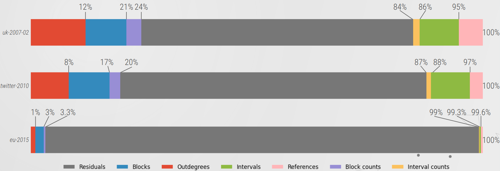
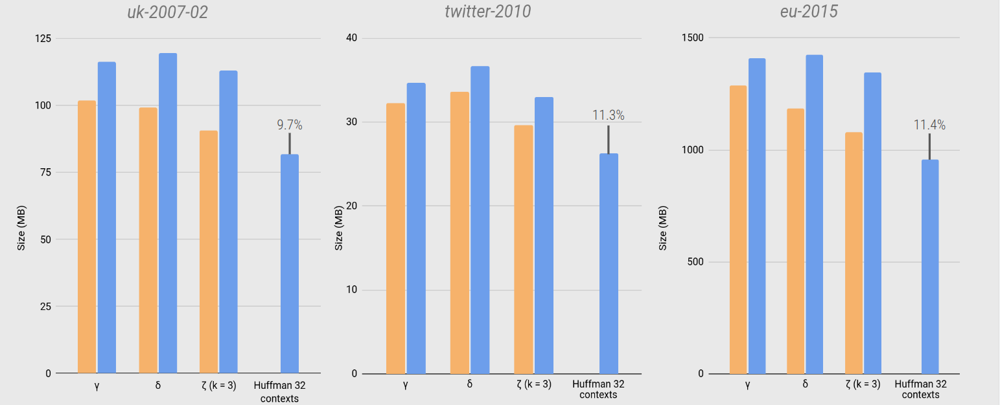
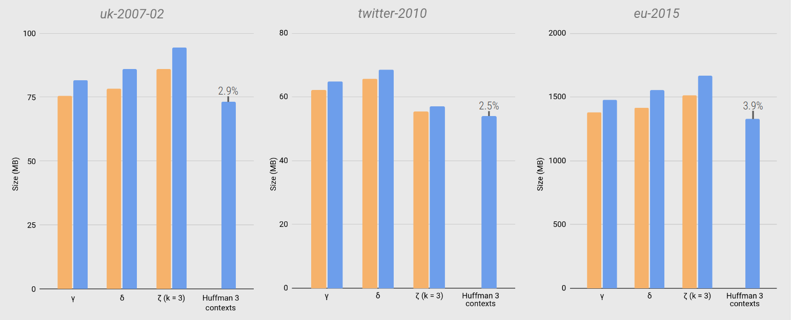
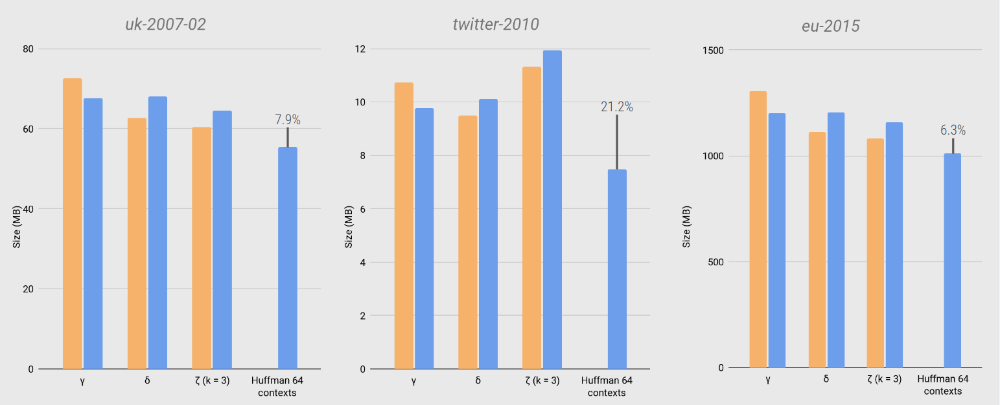
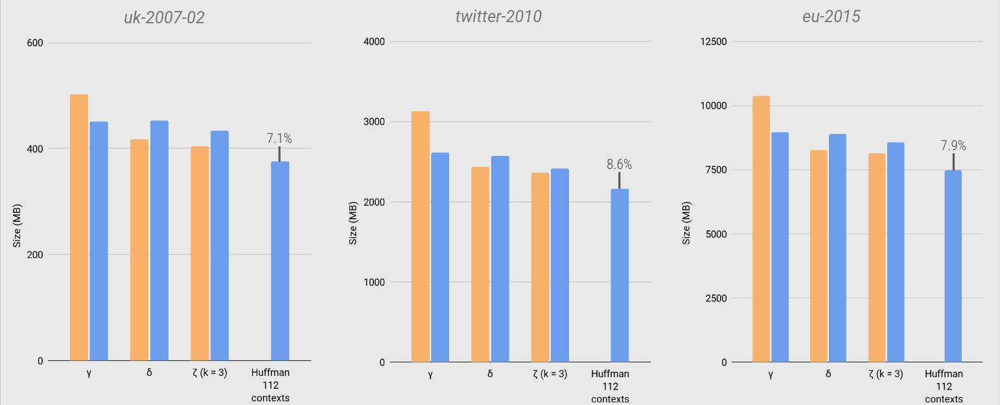
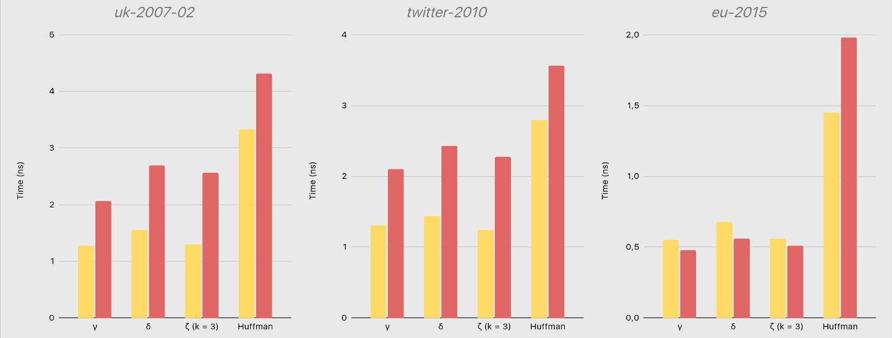
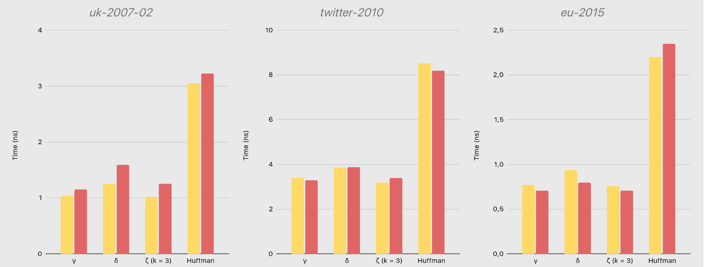
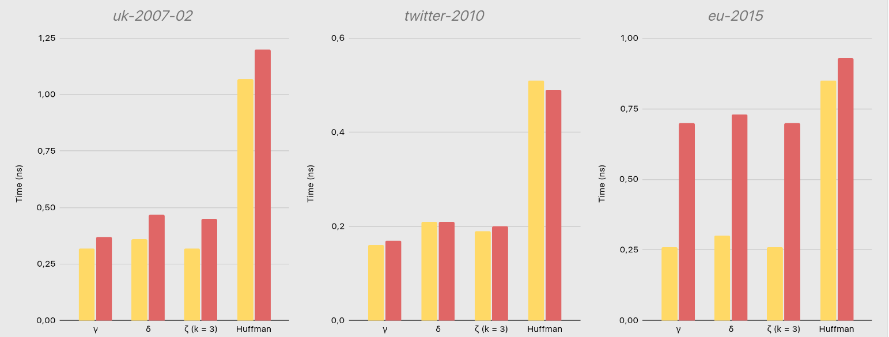
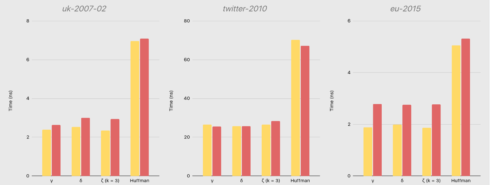
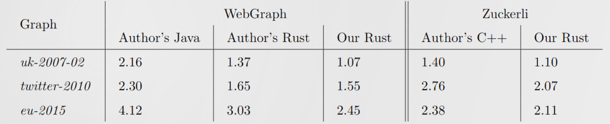

# WebGraph (+ Zuckerli)
This repository contains the final result of my MSc thesis on the implementation and experimentation of the WebGraph_[1]_ and Zuckerli_[2]_ graph compression frameworks.

The project assumes that the final user will need to decompress single random-accessed adjacency lists, thus without the need to decompress the whole graph before querying it. 
For this reason, the primary implementation aim was to provide an as fast as possible average list decompression time, trying to improve WebGraph's original Java version.

## Structure and usage

The `main.rs` file contains the `main` function, which is the primary program entry point. It allows decompressing and recompressing graphs that have been previously compressed through WebGraph. 
Additionally, the user can provide the `-a` flag to indicate that the input graph is in ASCII format, that is a representation where each node together with its adjacency list is on a different line. 
More precisely, each line has the node id (an integer) as its first element, followed by the sequence of successors of that node.
Moreover, beyond specifying compression parameters as defined in _[1]_, that is the window size, the maximum reference chain length, and the minimum interval size, the user can also indicate which integer
encoders to use for each section of the compressed graph:
- Outdegree
- Reference
- Blocks count
- Blocks
- Intervals
- Residuals
- Offsets

The possible encodings are:
- Unary
- Gamma
- Delta
- Zeta_[3]_ (together with its shrinking factor)

Due to the assumption of being able to decompress random-accessed adjacency lists, the `.offsets` file will always be generated after the compression.
It is possible to compress the offsets by using _Elias-Fano_ through the `-ef` flag.
If the input graph has no `.offsets` file, the utility binary `generate_offsets.rs` allows its creation starting from a compressed graph.

Besides WebGraph, also the Zuckerli representation has been implemented, allowing the use of this more modern compression framework on WebGraph-compressed graphs. 
Due to initial design assumptions (use of compile-time generics), implementing this program's module required the development of two binaries, namely `compress_zuckerli` and `decompress_zuckerli` (and their respective structure-modification files `zuckerli_in.rs` and `zuckerli_out.rs`).
The functionalities of the former are those of reading a WebGraph-compressed graph, decoding it, and compressing it in Zuckerli representation. Similarly, the second binary reads a Zuckerli-compressed graph and writes it in WebGraph representation.

Aside from the Zuckerli version, a hybrid version of the framework has been built, using WebGraph's structure but adding some of Zuckerli's features, i.e. Huffman coding over multiple contexts and Zuckerli's hybrid integer encoding scheme to reduce the size of Huffman's alphabet.
The rationale behind this third implementation is that we wanted to conduct some experiments on the application of different integer encodings on the different sections of WebGraph, thus we had to use the exact same program to precisely compare the results.
For Zuckerli's same reason, integrating this third version of the project required the creation of two additional binaries (and modifications of the WebGraph files), namely `decompress_huff` (and `bvgraph_huffman_in.rs`), and `compress_huff` (and `bvgraph_huffman_out.rs`).

Finally, we provide the `decompress_to_ascii` binary for decompressing a WebGraph-compressed file and writing its contents to file in ASCII format.

Unfortunately, for the same early design choices described previously, compressing (and decompressing) a graph having a different integer encoder combination for the seven WebGraph sections from the four provided requires the user to add his own combination to the `main` function, copying and pasting one of the other combinations and replacing the encoding type for the area which he wants to change.
The four predefined combinations are:
|                    | Outdegree | Reference | Blocks count | Blocks   | Intervals | Residuals | Offsets  |
|--------------------|-----------|-----------|--------------|----------|-----------|-----------|----------|
| First combination  | $\gamma$  | $\gamma$  | $\gamma$     | $\gamma$ | $\gamma$  | $\gamma$  | $\gamma$ |
| Second combination | $\delta$  | $\delta$  | $\delta$     | $\delta$ | $\delta$  | $\delta$  | $\delta$ |
| Third combination  | $\zeta$   | $\zeta$   | $\zeta$      | $\zeta$  | $\zeta$   | $\zeta$   | $\zeta$  |
| Fourth combination | $\gamma$  | _Unary_   | $\gamma$     | $\gamma$ | $\gamma$  | $\zeta$   | $\gamma$ |
where the last one is the default used by WebGraph's datasets.

## Experiments and results

We've chosen the following three graphs as datasets for our tests and experiments, with the first and the third being Web graphs and the second being a social graph.

| Graph                             | Nodes (in millions) | Edges (in millions) | Edges/Node |
|-----------------------------------|---------------------|---------------------|------------|
| _uk-2007-02__[1][3]_   | ~110                | ~3944               | ~36        |
| _twitter-2010__[1][3]_ | ~41                 | ~1468               | ~35        |
| _eu-2015__[1][3][4]_   | ~1070               | ~91792              | ~91        |

Next, we studied the final size of each WebGraph-compressed graph section, for each of our test graphs, finding out that residuals are by far the heaviest (size-wise) area, followed then by the outdegrees, blocks, and intervals.
For this reason, the following experiments have been performed on these four areas.

Next, we compared the size occupied for each area, for each graph, by the different integer encoding techniques. Moreover, for each encoding technique, we've also reported the result of pre-applying Zuckerli's hybrid integer encoding to reduce the magnitude of the integer.
Huffman results without Zuckerli's coding are not reported since, for all of our graphs, the alphabet grew so large that our test machine could not hold it in main-memory, crashing the program.

We conclude that Zeta coding is the universal integer encoder that compresses the most (accounting for the fact that residuals are the largest area in all of the graphs).

Following, we tried to compare the average integer decoding speed for each of the encoding schemes. The results are reported both by decoding through a sequential access of the graph and by a random list access, trying to see whether cache misses impact the final results.

By these experiments and the previous ones, we conclude that it is more convenient to use Zeta coding to obtain reasonable compression ratios (the best among static codes) and a decompression speed similar to Gamma (which is the fastest). 
If instead, the user aims to obtain the best possible compression ratio while sacrificing three times the time used for decoding by static coders, then Huffman is by far the best choice.

Finally, we made some comparisons between the average randomly accessed adjacency list decompression time of our WebGraph implementation, the original Java version, and the Rust version [published](https://github.com/vigna/webgraph-rs/) by the original author while we where working on this thesis.
Moreover, we performed the same comparison between our Rust Zuckerli implementation and the original one in C++.

As we can see, we obtain up to 50% speedup when compared to WebGraph's Java implementation, and up to 22% over the author's Rust implementation.
Similarly, we have a 21% speed gain with respect the Zuckerli's C++ implementation.

## TODOs

- Refactor the use of template parameters to specify encoding types in order to merge the three project versions and allow different encoding combinations instead of the four provided inside the `main`.
- Better adapt compression to the real distribution of values.
- Implement parallel compression to speedup the graph encoding process.

-------------------------------- 

_[1]  Boldi, P., and Vigna, S. The WebGraph framework I: Compression techniques. In Proc. of the Thirteenth International World Wide Web Conference (WWW 2004) (Manhattan, USA, 2004), ACM Press, pp. 595–601._

_[2] Luca Versari, Iulia-Maria Comsa, Alessio Conte, Roberto Grossi: Zuckerli: A New Compressed Representation for Graphs. IEEE Access 8: 219233-219243 (2020)._

_[3] Boldi, P., Rosa, M., Santini, M., and Vigna, S. Layered label propagation: A multiresolution coordinate-free ordering for compressing social networks. In Proceedings of the 20th international conference on World Wide Web (2011), S. Srinivasan, K. Ramamritham, A. Kumar, M. P. Ravindra, E. Bertino, and R. Kumar, Eds., ACM Press, pp. 587–596._

_[4] Boldi, P., Marino, A., Santini, M., and Vigna, S. BUbiNG: Massive crawling for the masses. In Proceedings of the Companion Publication of the 23rd International Conference on World Wide Web (2014), International World Wide Web Conferences Steering Committee, pp. 227–228._
